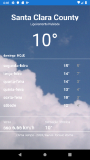
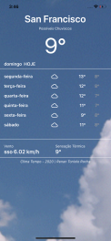

# App Clima Tempo
 Projeto de um aplicativo para demonstar a temperatura da região (por geolocalização) e dos próximos 7 dias usando o framework `xamrin forms`.
 
  ### Projeto desenvolvido ultilizando:
  - [x] Xamarin forms v4.4
  - [x] MVVM
  - [x] Xamarin.Essentials
  - [x] Newtonsoft.Json
  - [x] NUnit (teste unitário)
  
 ## Print Screen :foggy:
 
|  | |
|:---:|:---:|
| Android | iOS |

